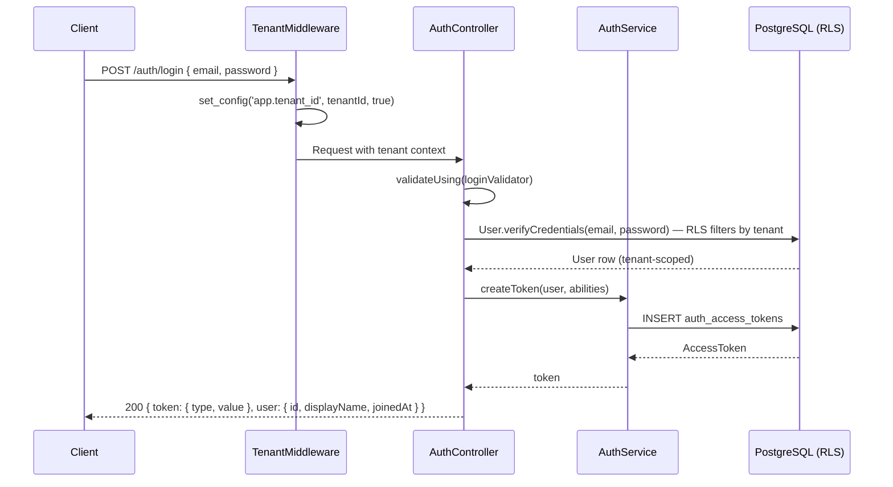
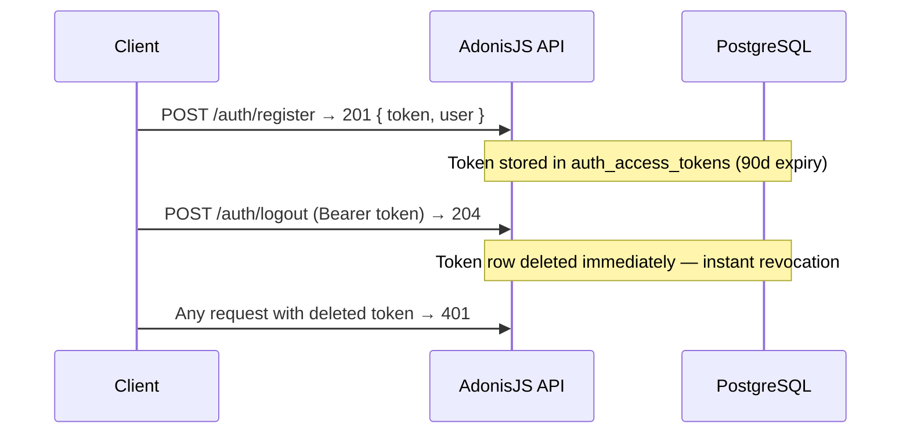

# Authentication & Identity API

> **SRS Rules:** RN-001, RN-005
> **Requirements:** AUTH-01 through AUTH-08
> **Updated:** In the same commit as code changes (D-06)

## Overview

Handles user registration, email/password login, Google OAuth, token management, public profile retrieval, and account deletion. All endpoints are tenant-scoped via TenantMiddleware.

**Base path:** `/auth`, `/users`
**Authentication:** Bearer token (opaque, DB-backed, 90-day expiry)
**Tenant-scoped:** Yes — TenantMiddleware sets `app.tenant_id` before every query

## Authentication Flow



## Token Lifecycle



## Endpoints

### POST /auth/register

**Description:** Register a new citizen account. Email must be unique within the tenant.
**Authentication:** None
**Rate limit:** None in Phase 2

**Request body:**

| Field | Type | Required | Constraints | Description |
|-------|------|----------|-------------|-------------|
| `email` | `string` | Yes | max 254 chars, valid email format | User email — unique per tenant |
| `password` | `string` | Yes | min 8, max 72 chars, 1 uppercase, 1 digit | Will be bcrypt-hashed |
| `displayName` | `string` | Yes | min 2, max 100 chars, no HTML | Public display name |

**Request headers:**

| Header | Required | Description |
|--------|----------|-------------|
| `X-Tenant-ID` | Yes | UUID v7 of the target tenant (read by PublicTenantMiddleware) |

**Response (201 Created):**
```json
{
  "token": { "type": "bearer", "value": "oat_Sg4HvlmB..." },
  "user": { "id": 1, "displayName": "Maria Silva", "joinedAt": "2026-03-24T00:00:00.000Z" }
}
```

**Error responses:**

| Status | Shape | Description |
|--------|-------|-------------|
| 400 | `{ "message": "X-Tenant-ID header is required." }` | Missing tenant header |
| 404 | `{ "message": "Tenant not found." }` | Tenant UUID not found |
| 409 | `{ "message": "Este e-mail já está registrado neste município." }` | Email already registered in this tenant |
| 422 | `{ "errors": [{ "field": "email", "message": "...", "rule": "..." }] }` | VineJS validation failure |

---

### POST /auth/login

**Description:** Authenticate with email and password. Returns a new access token.
**Authentication:** None

**Request body:**

| Field | Type | Required | Description |
|-------|------|----------|-------------|
| `email` | `string` | Yes | Registered email |
| `password` | `string` | Yes | Account password |

**Request headers:**

| Header | Required | Description |
|--------|----------|-------------|
| `X-Tenant-ID` | Yes | UUID v7 of the target tenant |

**Response (200 OK):** Same shape as register (token + user object).

**Error responses:**

| Status | Shape | Description |
|--------|-------|-------------|
| 401 | `{ "message": "E-mail ou senha incorretos. Verifique suas credenciais e tente novamente." }` | Invalid credentials (same message for wrong password AND unknown email — no user enumeration) |
| 422 | VineJS errors array | Malformed request |

---

### POST /auth/logout

**Description:** Invalidate the current access token. Immediate revocation — token is deleted from DB.
**Authentication:** Required (Bearer token)

**Response (204 No Content):** No body.

**Error responses:**

| Status | Shape | Description |
|--------|-------|-------------|
| 401 | `{ "message": "Token inválido ou expirado." }` | Missing or invalid token |

---

### GET /auth/google/redirect

**Description:** Initiate Google OAuth flow. Redirects to Google's authorization endpoint.
**Authentication:** None
**Note:** Uses stateless mode — no CSRF state cookie (required for mobile API clients).

**Request headers:**

| Header | Required | Description |
|--------|----------|-------------|
| `X-Tenant-ID` | Yes | UUID v7 of the target tenant (carried into callback via OAuth state param or client-side redirect) |

**Response (302 Redirect):** No JSON body. Client follows redirect to Google.

---

### GET /auth/google/callback

**Description:** OAuth callback — Google redirects here after authorization. Creates or links account.
**Authentication:** None
**Account linking (D-08):** If Google email matches existing tenant user → auto-link. No error, no friction.
**New account (D-09):** If Google email unknown → create user with `role: 'citizen'` and unusable password.

**Response (200 OK):** Same shape as login (token + user object).

**Error responses:**

| Status | Shape | Description |
|--------|-------|-------------|
| 400 | `{ "message": "Token inválido ou expirado." }` | OAuth error or state mismatch |
| 401 | `{ "message": "Token inválido ou expirado." }` | User denied Google access |

---

### GET /users/me

**Description:** Return the authenticated user's public profile.
**Authentication:** Required (Bearer token)
**Note (AUTH-06):** Response contains only id, displayName, joinedAt. No email, no role, no internal fields.

**Response (200 OK):**
```json
{
  "user": { "id": 1, "displayName": "Maria Silva", "joinedAt": "2026-03-24T00:00:00.000Z" }
}
```

**Error responses:**

| Status | Shape | Description |
|--------|-------|-------------|
| 401 | `{ "message": "Token inválido ou expirado." }` | Missing or invalid token |

---

### DELETE /users/me

**Description:** Permanently delete account. PII is anonymized (tombstone row preserved for FK integrity). All tokens invalidated immediately.
**Authentication:** Required (Bearer token)
**Idempotency:** Second DELETE with expired/deleted token returns 401.

**Response (204 No Content):** No body.

**Anonymization (AUTH-07, RN-005):**
- `email` → `deleted-{id}@anonymized.invalid`
- `display_name` → `"Cidadão Anônimo"` (exact string — RN-005 locked requirement)
- `password` → null
- `deleted_at` → current timestamp
- All tokens in `auth_access_tokens` → hard deleted (AUTH-08)

**Error responses:**

| Status | Shape | Description |
|--------|-------|-------------|
| 401 | `{ "message": "Token inválido ou expirado." }` | Missing or invalid token |

---

## Client-Side Token Handling

- Store tokens in OS secure storage: **iOS Keychain** or **Android Keystore**
- Never store in `localStorage`, `sessionStorage`, or plain-text files
- Transmit only over HTTPS via `Authorization: Bearer {token}` header
- Token expiry: 90 days from creation. Re-authenticate via `POST /auth/login` for a fresh token.
- Apple OAuth is deferred to v2 (no reliable `@adonisjs/ally` driver available)

## SRS References

| Rule ID | Description |
|---------|-------------|
| RN-001 | User registration and authentication requirements |
| RN-005 | Account deletion with PII anonymization; "Cidadão Anônimo" display name |
