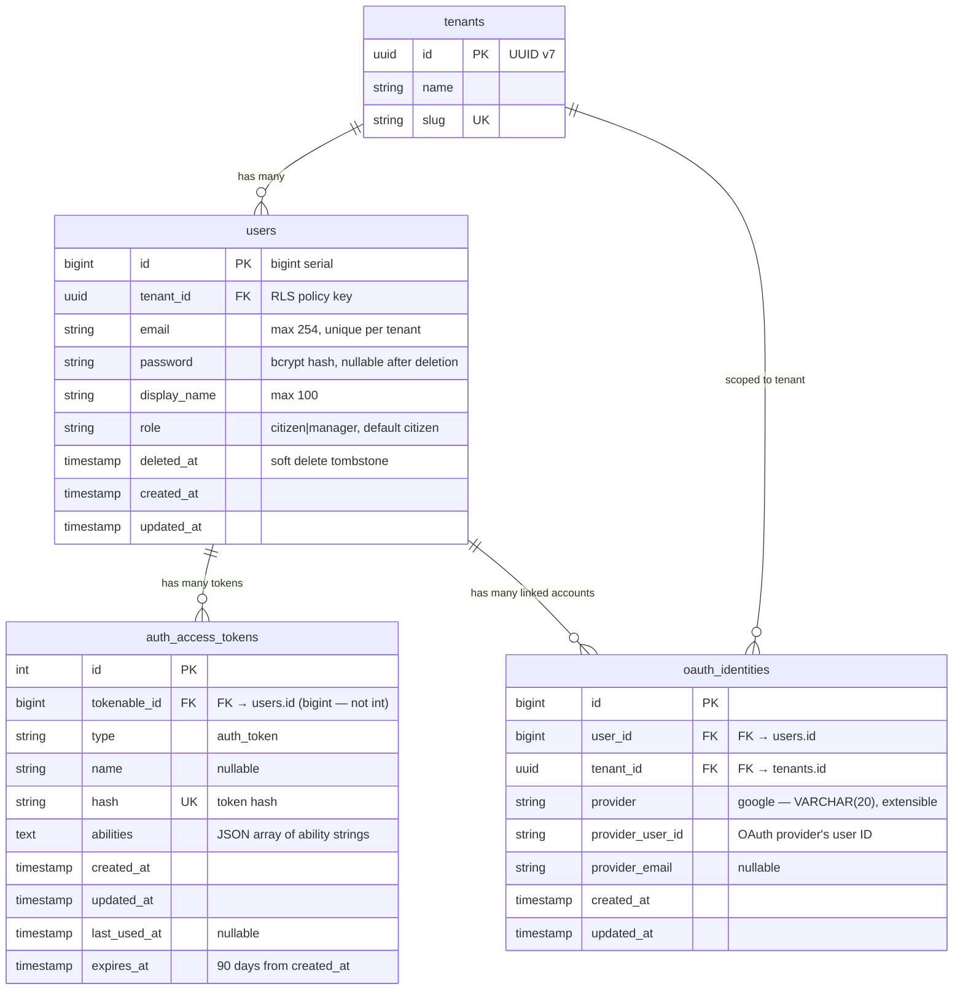

# Authentication & Identity Data Models

> **SRS Rules:** RN-001, RN-005
> **Requirements:** AUTH-01 through AUTH-08
> **Updated:** In the same commit as code changes (D-06)

## Entity Relationship Diagram



## Tables

### users

**Migration file:** `database/migrations/002_auth_users.ts`
**RLS:** Enabled — FORCE ROW LEVEL SECURITY
**PK type:** bigint serial

| Column | Type | Nullable | Default | Constraints | Description |
|--------|------|----------|---------|-------------|-------------|
| `id` | `bigint` | No | serial | PK | Auto-increment primary key |
| `tenant_id` | `uuid` | No | — | FK → tenants.id, RLS key | Tenant scope |
| `email` | `varchar(254)` | No | — | UNIQUE (tenant_id, email) | Email — unique per tenant, not globally |
| `password` | `varchar(255)` | Yes | — | — | bcrypt hash; NULL for OAuth-only accounts after deletion |
| `display_name` | `varchar(100)` | No | — | — | Public display name |
| `role` | `varchar(20)` | No | `citizen` | CHECK in (`citizen`, `manager`) | Authorization role |
| `deleted_at` | `timestamp` | Yes | null | — | Soft-delete tombstone (D-18) |
| `created_at` | `timestamp` | No | now() | — | Serialized as `joinedAt` in API responses |
| `updated_at` | `timestamp` | No | now() | — | Internal only |

**Indexes:**

| Name | Columns | Purpose |
|------|---------|---------|
| `users_tenant_id_email_unique` | `(tenant_id, email)` | Enforces per-tenant email uniqueness |
| `users_tenant_id_index` | `tenant_id` | RLS policy lookup |

**RLS Policy:**
```sql
CREATE POLICY users_tenant_isolation ON users
  USING (tenant_id = current_setting('app.tenant_id', true)::uuid)
  WITH CHECK (tenant_id = current_setting('app.tenant_id', true)::uuid);
```

---

### auth_access_tokens

**Migration file:** `database/migrations/003_auth_access_tokens.ts`
**RLS:** None — tenant isolation enforced via users JOIN
**PK type:** int serial
**Critical:** `tokenable_id` is `bigint` — must match `users.id` type. Using `integer` would silently truncate large IDs.

| Column | Type | Nullable | Default | Description |
|--------|------|----------|---------|-------------|
| `id` | `int` | No | serial | PK |
| `tokenable_id` | `bigint` | No | — | FK → users.id (bigint) |
| `type` | `varchar` | No | — | Always `auth_token` |
| `name` | `varchar` | Yes | null | Device/session name |
| `hash` | `varchar` | No | — | UNIQUE — token hash for lookup |
| `abilities` | `text` | No | — | JSON array: citizen=`['reports:write',...]`, manager=`['*']` |
| `created_at` | `timestamp` | No | — | Token creation time |
| `updated_at` | `timestamp` | No | — | Last update |
| `last_used_at` | `timestamp` | Yes | null | Last request timestamp |
| `expires_at` | `timestamp` | Yes | null | 90 days from created_at |

---

### oauth_identities

**Migration file:** `database/migrations/004_auth_oauth_identities.ts`
**RLS:** None on this table; access controlled via user_id FK
**PK type:** bigint serial

| Column | Type | Nullable | Default | Constraints | Description |
|--------|------|----------|---------|-------------|-------------|
| `id` | `bigint` | No | serial | PK | |
| `user_id` | `bigint` | No | — | FK → users.id | Owner user |
| `tenant_id` | `uuid` | No | — | FK → tenants.id | Tenant scope |
| `provider` | `varchar(20)` | No | — | — | OAuth provider: `google` (extensible — no schema change for new providers) |
| `provider_user_id` | `varchar(255)` | No | — | UNIQUE (tenant_id, provider, provider_user_id) | Provider's user ID |
| `provider_email` | `varchar(254)` | Yes | null | — | Email from OAuth provider |
| `created_at` | `timestamp` | No | — | — | |
| `updated_at` | `timestamp` | No | — | — | |

**Unique constraint:** `(tenant_id, provider, provider_user_id)` — prevents duplicate identity links per tenant.

## SRS References

| Rule ID | Description |
|---------|-------------|
| RN-001 | User registration and authentication requirements |
| RN-005 | Account deletion with PII anonymization |
