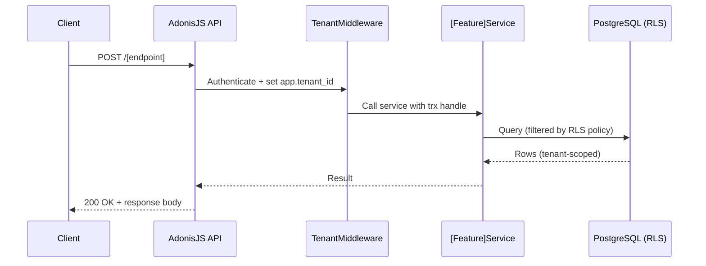

# [Feature Name] API

> **Template version:** 1.0
> Copy this file to `docs/features/{feature-name}/API.md` and fill in all sections.
> Docs updated in the same commit as code changes (D-06).
> All diagrams use Mermaid fenced blocks (D-30).

## Overview

Brief description of what this feature's API does.

**Base path:** `/[base-path]`
**Authentication:** [Required / Optional / None]
**Tenant-scoped:** [Yes / No]

## Request Flow



## Endpoints

### [METHOD] /[path]

**Description:** What this endpoint does.
**Authentication:** Required / None
**Rate limit:** [throttle key] — [N requests per window]

**Request body:**

| Field | Type | Required | Constraints | Description |
|-------|------|----------|-------------|-------------|
| `field_name` | `string` | Yes | max 255 chars | Description |

**Response (200 OK):**

```json
{
  "id": 1,
  "field": "value"
}
```

**Error responses:**

| Status | Code | Description |
|--------|------|-------------|
| 400 | `VALIDATION_ERROR` | Request body failed VineJS validation |
| 401 | `UNAUTHORIZED` | Missing or invalid access token |
| 404 | `NOT_FOUND` | Resource not found (also returned on cross-tenant access) |
| 422 | `UNPROCESSABLE_ENTITY` | Business rule violation |
| 429 | `TOO_MANY_REQUESTS` | Rate limit exceeded |

## SRS References

| Rule ID | Description |
|---------|-------------|
| [RN-XXX] | [Rule description] |
