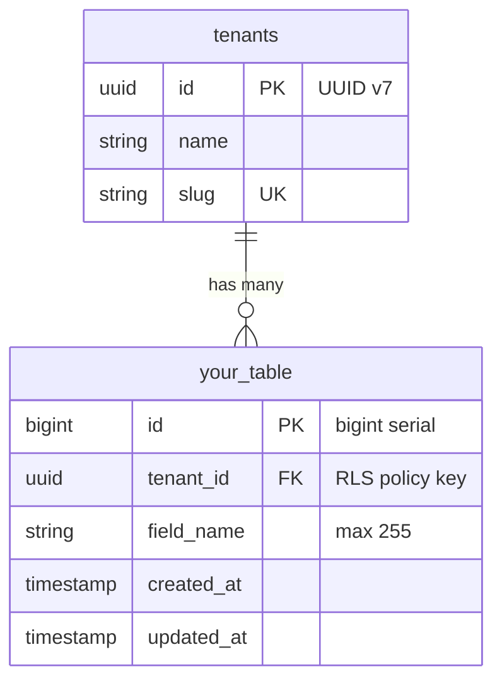

# [Feature Name] Data Models

> **Template version:** 1.0
> Copy this file to `docs/features/{feature-name}/MODELS.md` and fill in all sections.
> All diagrams use Mermaid fenced blocks (D-30).

## Entity Relationship Diagram



## Tables

### [table_name]

**Migration file:** `database/migrations/[NNN]_[feature]_[table].ts`
**RLS:** [Enabled / Not applicable]
**PK type:** [bigint serial / uuid v7]

| Column | Type | Nullable | Default | Constraints | Description |
|--------|------|----------|---------|-------------|-------------|
| `id` | `bigint` | No | serial | PK | Auto-increment primary key |
| `tenant_id` | `uuid` | No | — | FK → tenants.id, RLS key | Tenant scope |
| `field_name` | `varchar(255)` | No | — | CHECK (char_length <= 255) | Description |
| `created_at` | `timestamp` | No | now() | — | Creation timestamp |
| `updated_at` | `timestamp` | No | now() | — | Last update timestamp |

**Indexes:**

| Name | Columns | Type | Purpose |
|------|---------|------|---------|
| `[table]_tenant_id_idx` | `tenant_id` | BTREE | RLS policy lookup |

**RLS Policy:**
```sql
CREATE POLICY tenant_isolation ON [table_name]
  USING (tenant_id = current_setting('app.tenant_id', true)::uuid)
  WITH CHECK (tenant_id = current_setting('app.tenant_id', true)::uuid);
```

## SRS References

| Rule ID | Description |
|---------|-------------|
| [RN-XXX] | [Rule description] |
